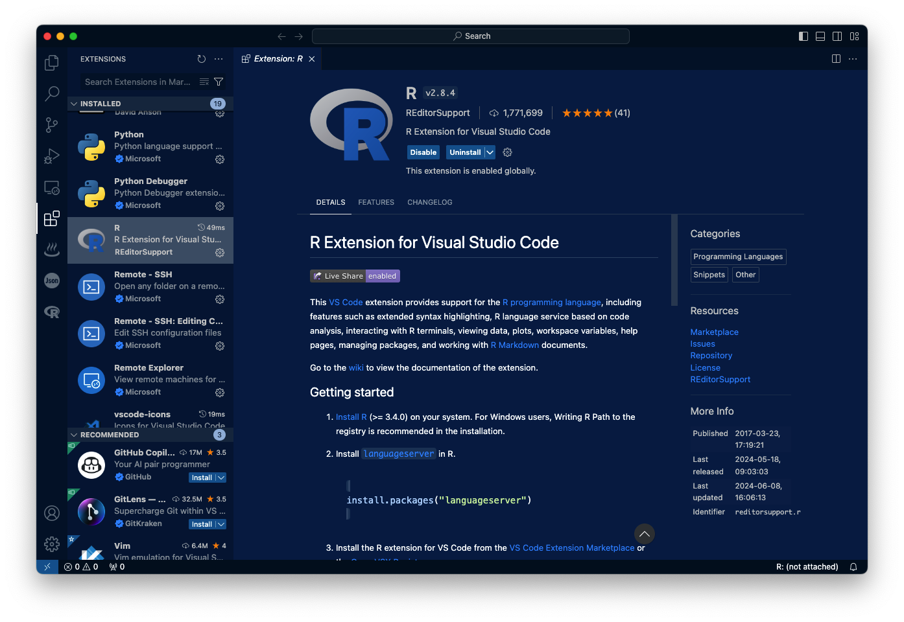

# Usage(用法) 

每个 **bookdown** 章节都是一个 `.Rmd` 文件，每个 `.Rmd` 文件只能包含一个章节。一个章节 *必须* 以一级标题开始：`# 一个好的章节`，并且可以包含一个（且只能有一个）一级标题。

在章节内部使用二级标题及更高级别的标题，例如：`## 一个简短的小节` 或 `### 一个更短的小节`。

`index.Rmd` 文件是必需的，并且也是您的第一章。当您渲染这本书时，它将成为主页。

常见的文档结构如下：

```
my_book_project/
├── index.Rmd
├── 01-chapter1.Rmd
├── 02-chapter2.Rmd
├── _bookdown.yml
└── _output.yml
```

## Render book(渲染这本书)

您可以在不更改任何内容的情况下，渲染此示例书籍的 HTML 版本：

1. 在 RStudio IDE 中找到 **Build** 面板，然后

2. 单击 **Build Book**，然后选择您的输出格式，或者如果您想要从相同的书籍源文件中使用多个格式，则选择 "All formats"。

或者从 R 控制台构建书籍：

```{r, eval=FALSE}
bookdown::render_book()
```

要将此示例渲染为 `bookdown::pdf_book`，您需要安装 $XeLaTeX$。建议您安装 TinyTeX（其中包含 $XeLaTeX$）：<https://yihui.org/tinytex/>。

当然你也可以下载别的$TeX$发行版，比如[TeXLive](https://tug.org/texlive/)和[MaCTeX](https://tug.org/mactex/)。对于`TeXLive`的下载可以参照[LaTeX:TeXLive2021安装](https://zhuanlan.zhihu.com/p/362201376)来进行；`MaCTeX`则可以参照[]()

>notice:在24年8月的时候，对文档进行了一次扩充和完善，但是文档增加和指令变多后，发现使用Rstudio界面中的`Knit`按钮无法完成对全文档的编译，如果 one by one 编译，会出现各文档不连贯的状态，并且在部分子文档中，出现部分代码无法编译，例如`could not find ggplot function`的情形，在此时应在`Console`终端输入`bookdown::render_book("index.Rmd")`来对全文档进行编译（在此之前你需要`Set Working Directory`）。

## Preview book(预览这本书)

在您工作时，您可以启动本地服务器以实时预览这本 HTML 书籍。当您保存单独的 `.Rmd` 文件时，此预览将会更新。您可以通过使用 RStudio 的插件 "Preview book" 或从 R 控制台中启动服务器。

```{r eval=FALSE}
bookdown::serve_book()
```


```{r include=FALSE}
# automatically create a bib database for R packages
knitr::write_bib(c(
  .packages(), 'bookdown', 'knitr', 'rmarkdown'
), 'packages.bib')
```


## 安装R+Rstudio

R语言是一种自由软件编程语言与操作环境，主要用于统计分析、绘图以及数据挖掘。R由新西兰奥克兰大学的统计学家罗斯·伊哈卡和罗伯特·杰特曼开发，现在由R核心小组负责开发，同时也有其他用户编写了诸多外挂的软件包。R以S语言为基础，其词法作用域语义来自Scheme。R的后台程序大多由C语言、FORTRAN语言和R语言自己写成。

回归正题，要使用`rmarkdown`需要我们使用`R`与`Rstudio`，我们可以从[R page](https://www.r-project.org/)来下载`R`这个程序，
`R` 是一个用于统计计算和图形的免费软件环境；再从[Rstudio](https://www.rstudio.com/categories/rstudio-ide/)来下载适配R的集成开发编辑器，普通的`R script`可以在`vscode`中进行编辑和运行，但是`rmarkdown`文件则需要再`Rstudio`中才能较好的编辑与运行。

安装的步骤可以参考[在macOS中安装R与Rstudio](https://zhuanlan.zhihu.com/p/687529684)

>Notice：macOS需要看一下是Intel还是ARM的CPU，ARM目前在M1/M2上搭载

## 创建一个Rmarkdown文件

因为我们要将这个文件配置到GitHub上作为网页，所以我们要创建一个特别一点的rmarkdown。

### 首先我们要安装一个专门的包`bookdown`

```{r,eval=FALSE}
# from CRAN
install.packages('rmarkdown')

or

# install from GitHub
devtools::install_github('rstudio/rmarkdown')
```

### 在set部分load `bookdown`

```{r,eval=FALSE}
library(rmarkdown)
```

### 其他宏包的需求与使用

如果要⽣成PDF输出，则需要安装LaTeX。对于从未安装过LaTeX的R Markdown⽤户，建议安装TinyTeX：

```{r,eval=FALSE}
install.packages('tinytex')
tinytex::install_tinytex()
```

> TinyTex是Yihui Xie专为R Markdown开发的超轻量级的Latex环境，是⼀种轻便、可移植、跨平台、易于维护的LaTeX发⾏版。R中的配套软件包tinytex可以帮助我们在将LaTeX或R Markdown⽂档编译为PDF时⾃动安装缺少的LaTeX软件包，并确保将LaTeX⽂档编译正确的次数以解决所有交叉引⽤。

当然你可以选择下载TeXLive（Windows or Linux）或MacTeX（macOS）。

### 创建一个`bookdown`文件

1. 创建项目

在Rstudio中点击File->New Project->New Directory->Bookproject using bookdown->Create Project

2. 文件配置

在新建的R Markdown⽂件⾥，主要包含三块内容：

- YAML: R Markdown的头部文件，YAML（YAML Ain't Markup Language）定义了R Markdown文档的元数据，包括文档的标题（title）、作者（author）、日期（date）、指定的输出文件类型（output format）等。YAML头部通常位于文档的开头，并用三条短划线（---）分隔。例如：

```{r,eval=FALSE}
---
title: "文档标题"
author: "作者姓名"
date: "2024-06-08"
output: html_document
---
```

- Markdown文本: Markdown文本是R Markdown文档的主要内容，使用者按照Markdown语法自行编写的文本内容。Markdown语法简洁易懂，适用于编写格式化文本，如标题、列表、引用、链接和图片等。示例：

```{r,eval=FALSE}
# 一级标题
这是一个段落。

- 无序列表项1
- 无序列表项2

1. 有序列表项1
2. 有序列表项2

> 这是一个引用。
```

- 代码块: R Markdown的一个主要功能是可以执行文档内的代码块，并将代码执行结果展示在Markdown文档中。这对撰写操作与分析报告带来了极大的便利，同时还可以进行良好的程序与结果复现。R Markdown文档中除了R代码段以外，还可以插入Python、SQL等许多编程语言的代码段。常用编程语言还可以与R代码段进行信息交换。代码块用三个反引号加上编程语言名称标识，例如：

python section

## 代码块的选项设置（options）

默认情况下代码和结果会在输出⽂件中呈现。如果通过参数来控制代码块运⾏结果的输出情况可以在`{r,options}`中设置。⼀般包括代码及运⾏结果的输出、图⽚表格格式定义等。

### 输出信息选项

- `eval`: 加选项`eval=FALSE`,可以使得代码仅显⽰⽽不实际运⾏。这样的代码段如果有标签，可以在后续代码段中被引⽤。
- `include`: 加选项`include=FALSE`，则本代码段仅运⾏，但是代码和结果都不写⼊到⽣成的⽂档中。
- `echo`: echo参数控制了Markdown是否显⽰代码块。若`echo=TRUE`，则表⽰代码块显⽰在markdown⽂档显⽰代码块；反之，代码块不出现在输出结果中。
- `collapse`: ⼀个代码块的代码、输出通常被分解为多个原样⽂本块中，如果⼀个代码块希望所有的代码、输出都写到同⼀个原样⽂本块中，加选项`collapse=TRUE`。
- `prompt`: `prompt=TRUE`代码⽤R的`>`提⽰符开始。
- `comment`：如果希望结果不⽤#号保护，使⽤选项`comment=''`。
- `results`: ⽤选项results=选择⽂本型结果的类型。取值有：
  - `markup`：这是缺省选项，会把⽂本型结果变成HTML的原样⽂本格式;
  - `hide`：运⾏了代码后不显⽰运⾏结果;
  - `hold`：⼀个代码块所有的代码都显⽰完，才显⽰所有的结果。
  - `asis`：⽂本型输出直接进⼊到HTML⽂件中，这需要R代码直接⽣成HTML标签，knitr包的kable()函数可以把数据框转换为HTML代码的表格。

### 错误信息选项

- `warning`：选项`warning=FALSE`使得代码段的警告信息不进⼊编译结果，⽽是在控制台中显⽰。有⼀些扩展包的载⼊警告可以⽤这种办法屏蔽。
- `error`：选项`error=FALSE`可以使得错误信息不进⼊编译结果，⽽是出错停⽌并将错误信息在控制台中显⽰。
- `message`：选项`message=FALSE`可以使得message级别的信息不进⼊编译结果，⽽是在控制台中显⽰。

### 全局设置
若R Markdown内的代码块存在⼀样的参数设置，则可以提前设计好全局的代码块参数。全局代码块通过`knitr::opts_chunk$set`函数进⾏设置，⼀般设置在YAML⽂件下⽅。

例如本文的设置为：

```{r,eval=FALSE}
# 设置knitr全局选项
knitr::opts_chunk$set(
  echo = TRUE,  # 是否显示代码
  eval = TRUE, #是否编译代码框内的代码
  highlight = TRUE, #是否语法高亮
  warning = FALSE,  # 是否显示警告
  message = FALSE,  # 是否显示信息
  fig.width = 7,  # 图形宽度
  fig.height = 5  # 图形高度
)
```

>Notice：局部参数设置优先级大于全局参数设置。

## 在vscode中编辑rmarkdown

大部分程序猿或者攻城狮应该都会对vscode比较熟悉，它提供了R Extension for Visual Studio Code，你可以在vscode中调用`R`对文档进行编译与修改，vscode相较于Rstudio最大的优势是可以直连GitHub，你可以将你创建的rmarkdown文件上传到GitHub，放置在你创建的GitHub主页中，使其成为一个个人主页/博客，从而在网络上展现出来，并可以被人检索到。

### 安装R extension

请打开vscode后看最左边的导航栏，选择`EXTENSIONS`后再`search`框中搜索`R`，
然后选择`install`。

{width=50%}

### 安装其他的软件

当你使用vscode提供的插件时，肯定无法和专门适配R的Rstudio的各项功能比较，如果你需要生成PDF文档，你可能会遇到无法完成编译的问题，这是由于渲染R Markdown文档时，需要使用至少版本1.12.3的Pandoc。

```
[VSC-R] index.Rmd process started
==> rmarkdown::render_site('/Users/uesrname/uesrname.github.io/index.Rmd')
Error: pandoc version 1.12.3 or higher is required and was not found (see the help page ?rmarkdown::pandoc_available).
In addition: Warning message:
In verify_rstudio_version() :
  Please install or upgrade Pandoc to at least version 1.17.2; or if you are using RStudio, you can just install RStudio 1.0+.

Execution halted
```

#### 安装Pandoc

针对上述的问题，你可能需要安装Pandoc这个软件，你可以在[Pandoc官网](https://pandoc.org/)了解相关信息和下载你需要的版本。

如果你是Windows用户，请进入[pandoc’s download page](https://github.com/jgm/pandoc/releases/tag/3.2)后下载安装包，然后进行安装。

如果你是Mac用户，一样可以进入[pandoc’s download page](https://github.com/jgm/pandoc/releases/tag/3.2)后下载安装包；当你的电脑中已经安装有homebrew时，你可以选择在终端输入`brew install pandoc`来安装Pandoc。

#### 检查Pandoc路径：

1. 安装完Pandoc后，确保系统中可以访问到Pandoc的可执行文件。
2. 你可以通过在终端中运行which pandoc来检查Pandoc的安装路径。

#### 指定Pandoc路径：

如果系统中有多个版本的Pandoc，你可以在R Markdown文档中使用`rmarkdown::render()`函数的pandoc参数来指定Pandoc的路径。
例如：`rmarkdown::render("index.Rmd", pandoc="/path/to/pandoc")`

一般来说，当你安装好Pandoc之后，在进入vscode进行编译后会正确生成`.html`文件，具体信息需要看vscode的output内容。当我进行编译后，output给出如下信息：

```
Output created: docs/index.html

Output created: /Users/username/username.github.io/docs/index.html

<<<vsc>>>docs/index.html<<<vsc>>>
[VSC-R] index.Rmd process exited with exit code null
```

如果出现上述信息则表示生成了正确的`index.html`文件，打开文件夹，选定该文件双击在浏览器打开进行查看。

如果你使用RStudio，可以在RStudio项目设置中指定Pandoc路径（一般不需要进行指定，因为Rstudio生成PDF是通过LaTeX）：

1. 打开RStudio，进入你项目的工作目录。
2. 点击菜单栏中的 "Tools" -> "Global Options" -> "Sweave"。
3. 在 "Sweave" 设置中，可以指定Pandoc路径。

## 与Rmarkdown的缘分

有很多方法制作一个学术主页/网站，我是过很多办法，最开始是使用`gridea`，那还是大二的故事，看见一个朋友搭建了一夜主页，我很好奇，也觉得很好玩（其实是逼格很高），我就觉得我也得来一个，奈何不是学计算机的，很多原理都没搞明白，网络问题也是很棘手，弄着弄着就没兴趣了，然后荒废了，当时也确实没什么东西可以写，纯粹就是为了装逼而装逼。

后来到了大四的时候，我看到[Academic page](https://academicpages.github.io/)，我就又觉得我行了，结果还是史无前例的大坑啊！因为这个网页的搭建是使用`jerkll`来生成静态网页，需要本地对其进行渲染然后在Internet中显示，我前期只是修改了一些信息然后就将其放置在GitHub上，然后在腾讯云租用了一个域名，将其关联（其实22年租用了域名以后，一直没搞好，专业知识太匮乏，没得办法~）。

关于这个坑啊，有时间再专门写一个post来讲~

后来学习准备二战，学着学着其实有点无聊，你懂吧~

就是啥都可以弄一弄，但是就是对专业课没有心思了，所以吧，我捉摸着学一学`R`，然后就一发不可收拾啊，又让我发现了`Rmarkdown`这个好东西，嘿嘿，用来做笔记其实挺爽的，刚好卫生统计学有不少公式和图标，都可以不错的解决~

这里就不是不说一下另外几个硬货的优缺点了，敲黑板···

**MSOFFICE**：微软的办公套装，Word没啥不好，就是公式难得处理，还是文本格式比较难以管控，一不小心就是划勒巴子散架了，成也灵活，败也灵活。

**LaTeX**：这个东西也是花了我很多时间去学的，特别是大一大二的时候，被高数老师说的数学建模比赛迷得七荤八素，然后高数老师在大一的寒假带着我们学习$LaTeX$这个啊，说我们先学会这个，其他的等开学了我再教，结果啊，碰上疫情，吹了，数学课题组没人管这个了，那好吧，我就自己玩。$LaTeX$就是很规矩，很硬，一板一眼，有自己独特的一套逻辑与美感，成也规矩，败也规矩。

**Ramrkdown**：受益于xieyihui的杰出构想与操作，将`markdown`、`LaTeX`与`html`结合起来，将`markdown`的轻量化与简洁同$LaTeX$的规矩与公式显示结合起来，再结合R对数据数据与分析的强大能力，形成了现在的`Rmarkdown`。

## 关于引用

原设置是：

```{r,eval=FALSE}
`r if (knitr::is_html_output()) '
# References {-}
'
```


